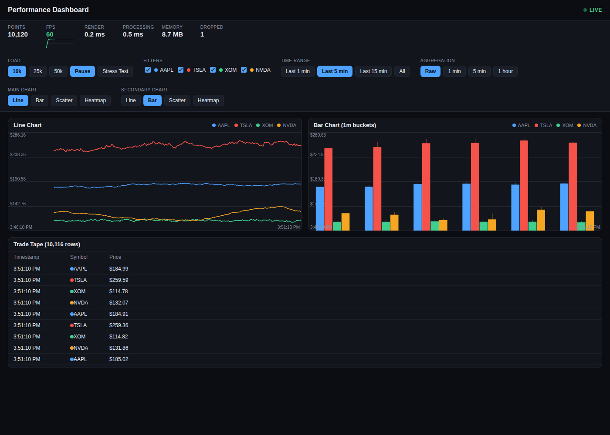

# Performance-Critical Data Visualization Dashboard

A real-time dashboard that streams 10,000–50,000+ simulated time-series points and
renders line, bar, scatter and heatmap charts on `<canvas>` at 60 FPS, built with
Next.js 14+ (App Router) and TypeScript. No charting library (no D3, no Chart.js) —
every renderer is hand-written canvas code.



## Setup

```bash
npm install
npm run dev       # http://localhost:3000 -> redirects to /dashboard
```

Production build (this is the mode the performance numbers below were measured in):

```bash
npm run build
npm start
```

Other scripts:

```bash
npm run typecheck   # tsc --noEmit
npm run lint        # next lint
```

## What's in the dashboard

- **4 simulated instruments** (AAPL, TSLA, XOM, NVDA), each driven by a genuinely
  different stochastic process — geometric Brownian motion, GBM + jump diffusion,
  Ornstein-Uhlenbeck mean reversion, and regime-switching momentum — with Gaussian
  (Box-Muller) noise, not the uniform-noise-on-a-sine-wave the first MVP pass used.
  See `lib/dataGenerator.ts` and `PERFORMANCE.md`'s "Randomness & the financial data
  model" section for why, and for a real boundary-clamping bug this design caught.
- **4 chart types** — Line, Bar, Scatter, Heatmap — pick any two to show at once via
  the "Main Chart" / "Secondary Chart" selectors (all four are exercised by switching).
  The Bar chart draws a high-low wick per bucket, not just the average.
- **Live streaming**: a new point per instrument every 100ms (20ms in Stress Test
  mode), each a continuation of that instrument's random walk from wherever the
  server-rendered initial dataset left it — no visible discontinuity when streaming
  takes over.
- **Load controls**: 10k / 25k / 50k total points, Start/Pause, Stress Test.
- **Interaction**: mouse-wheel zoom and click-drag pan directly on the Line/Scatter
  charts, double-click to snap back to following live data; Time Range presets
  (1min/5min/15min/All); instrument Filters; 1min/5min/1hour Aggregation (drives the
  Bar chart's bucket size).
- **Virtualized table** ("Trade Tape") over the entire live buffer (up to 50k rows) —
  only visible rows become real DOM nodes.
- **Performance monitor**: live FPS (with a rolling sparkline), render time,
  processing time, point count, and JS heap size (Chrome only) — all measured, never
  hardcoded. The LOD/aggregation math behind "processing" runs on a Web Worker
  (`public/workers/dataProcessor.worker.js`) rather than inline in the render loop —
  see `PERFORMANCE.md`'s "Web Worker offload" section.

## Performance testing instructions

1. `npm run build && npm start` (dev mode has extra instrumentation overhead and isn't
   representative — always benchmark the production build).
2. Open `/dashboard`, watch the **FPS** tile in the header for ~10s at the default 10k
   load.
3. Click **25k**, then **50k** — the dataset regenerates immediately at that size so you
   can see the renderer under load without waiting for the stream to fill up.
4. Click **Stress Test** to push the ingest rate to 20ms (5x normal) at whatever load
   level is selected.
5. Try zoom (scroll wheel over a chart) and pan (click-drag) on the Line or Scatter
   chart — the chart should track the cursor with no visible lag.
6. Leave it running for a few minutes and confirm **Points** plateaus (doesn't climb
   forever) and **Memory** doesn't trend strictly upward.

See `PERFORMANCE.md` for actual measured results (via an automated headless-Chromium
benchmark, not manual eyeballing) and the reasoning behind the architecture.

## Browser compatibility

- Built and tested against Chromium (via Playwright, see `PERFORMANCE.md`).
- Uses only standard Canvas 2D, `ResizeObserver`, and `requestAnimationFrame` — no
  Chromium-only APIs in the rendering path, so it's expected to work in current
  Firefox/Safari too.
- The **Memory** tile uses `performance.memory`, a non-standard Chrome API. It shows
  "n/a" in browsers that don't expose it (Firefox, Safari) — this is a display
  limitation only, not a functional one.

## Feature overview

| Area | What it demonstrates |
|---|---|
| `lib/dataGenerator.ts` | Seeded PRNG, Box-Muller Gaussian noise, 4 distinct stochastic models (GBM, GBM+jump, mean-revert, regime-switch) with log-space mean reversion to keep a long random walk bounded |
| `lib/buffer.ts` | Bounded sliding-window buffer (the "no unbounded growth" rule) |
| `hooks/useDataStream.ts` | 100ms ingest loop decoupled from React state/rendering |
| `hooks/useChartRenderer.ts` | Shared rAF loop + dirty-flag + DPR-aware resize for all 4 charts |
| `lib/search.ts` | Binary search for O(log n) viewport slicing of sorted buffers |
| `lib/numericProcessing.ts` + `public/workers/dataProcessor.worker.js` | Typed-array LOD/aggregation, offloaded to a Web Worker with a synchronous main-thread fallback |
| `hooks/useProcessedSeries.ts` | Owns the worker, back-pressure (one in-flight request), bootstrap + permanent fallback if Workers are unsupported |
| `hooks/useVirtualization.ts` + `components/ui/DataTable.tsx` | Row virtualization (CSS Grid rows, not `<table>`, so the header stays fixed through the virtualization transform) |
| `app/dashboard/page.tsx` | Server Component generating the initial dataset |
| `app/api/data/route.ts` | Route Handler demonstrating server-side data generation, streamed as NDJSON |

## P2 features (stretch, beyond P0/P1 MVP scope)

CLAUDE.md marks these "only if time remains" — all implemented and verified
(via `scripts/benchmark-p2.mjs`) after P0/P1 were complete and re-benchmarked:

| Feature | Where | What it does |
|---|---|---|
| 100k load level | `lib/types.ts`, `LoadControls.tsx`, `app/api/data/route.ts` | Fourth load tier beyond 10k/25k/50k; measured at a steady 60fps / 0 dropped frames (CLAUDE.md's stretch bar was only 15fps+) — see `PERFORMANCE.md`'s "100k load level" section |
| Advanced streaming | `app/api/data/route.ts` | Response body is NDJSON written incrementally to a `ReadableStream` (batches of 2,000 points), not one buffered JSON blob — a consumer can act on the first batch before the last one is even generated |
| Server Actions | `app/actions.ts`, wired via `hooks/useDataStream.ts`'s `randomize()` | A "🎲 Randomize" control button calls a `"use server"` function directly (no hand-written API route); reseeds the simulation server-side using Node's `crypto.randomInt` rather than client `Math.random()` |
| Middleware | `middleware.ts` | Adds `X-Frame-Options`, `X-Content-Type-Options`, `Referrer-Policy` to every response at the edge, before any route/page runs |
| Service Worker + PWA | `public/sw.js`, `public/manifest.json`, `components/ServiceWorkerRegistration.tsx` | Caches the app shell (network-first with cache fallback) and makes the app installable; deliberately never intercepts `/api/*` so live data can't be served stale |
| Advanced bundle analysis | `next.config.js`, `npm run analyze` | `@next/bundle-analyzer` wired in behind `ANALYZE=true`, off by default so normal builds are unaffected |

**Tried and reverted: sophisticated animations.** A per-row green/red tick
flash was added to the DataTable, then removed after it turned out to look
like a solid, distracting highlight instead of a brief pulse — the table
refreshes every 500ms but ticks arrive every 100ms, so a fresh flash kept
retriggering before the previous one's 900ms fade finished. Reverted rather
than tuned, since a table meant to be scanned quickly isn't the place for a
UI effect that has to be fought with timing tweaks to stay subtle.

**Not implemented: OffscreenCanvas.** CLAUDE.md lists it as P2 and separately
states "OffscreenCanvas/WebGL are not MVP requirements." The existing
canvas+rAF rendering pipeline is the part of this app that's been the most
heavily measured and tuned (60fps at every load level including 100k, LOD/
aggregation on a Web Worker, back-pressured async updates) — rerouting it
through OffscreenCanvas this late, on submission day, would mean touching
exactly that code for a feature CLAUDE.md itself doesn't require, with real
risk of destabilizing a working, benchmarked result for marginal additional
credit. Documented here rather than silently skipped.

## Next.js-specific optimizations used

- **Server Component for initial data** (`app/dashboard/page.tsx`): the first 10,000
  points exist before any client JS runs, generated with `export const dynamic =
  "force-dynamic"` so every request gets a fresh dataset instead of one frozen at
  build time.
- **Client Component boundary** kept as low as practical: only `DashboardClient.tsx`
  and the interactive leaves (`"use client"`) opt into client-side JS; layout/loading/
  error boundaries are server-rendered where possible.
- **`loading.tsx` / `error.tsx`** route-level boundaries for the `/dashboard` segment.
- Bundle stays well under the 500KB gzipped target — first load JS is ~110KB
  (see `PERFORMANCE.md`).

## Known, deliberate deviations from a literal reading of the spec

- **Axis tick labels are drawn on the canvas itself**, not as separate SVG/DOM
  elements. Axis labels have to repaint in lockstep with the chart during a 60fps
  pan/zoom drag; doing that through React-rendered SVG text would mean updating
  React state on every drag event, which reintroduces the per-frame React re-render
  this architecture exists to avoid. Legends, controls, and the table are HTML, as
  specified.
- One dependency version deviates from a literal "Next.js 14+": pinned to **Next.js
  15.5.25** instead of a 14.x release. Every 14.x release (and 15.x releases before
  15.5.24) carries a stack of disclosed CVEs with no available 14.x backport;
  15.5.25 is the newest patched release on a branch I have real familiarity with
  (Next 16 is a very recent major with API surface I can't vouch for). Full reasoning
  in `PERFORMANCE.md`.
